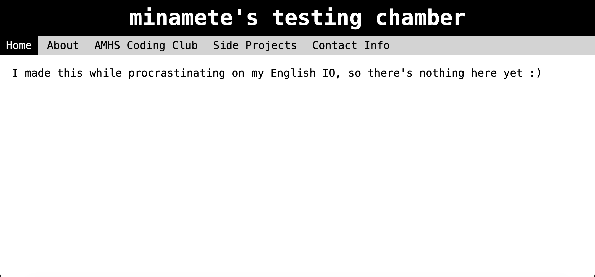
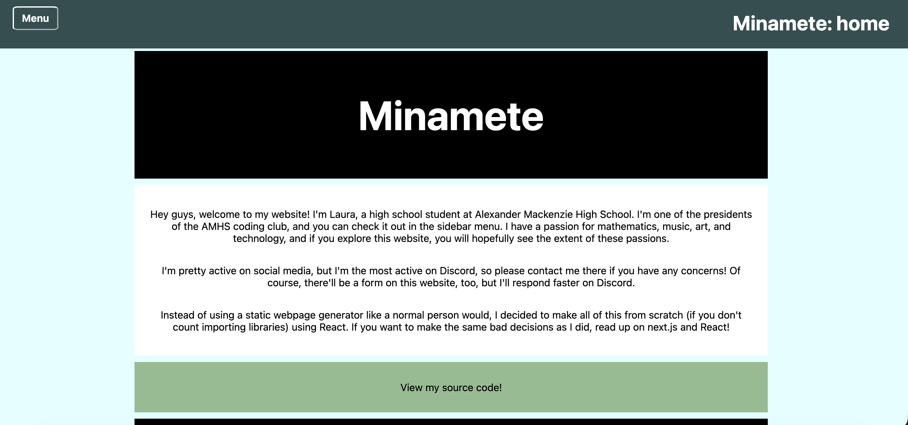

# revisiting an old website

#### 04/11/2026

I just finished my last exam of university (hopefully) today. As I sat around with genuinely nothing to do, I decided to revisit my old Github repos, where I discovered this artifact:

Scrolling through this website, I went down a thorough nostalgia trip. I had created this website a whole five (!!!) years ago, in the middle of COVID. Back then, I was in high school still, ChatGPT wasn't a thing, and my biggest project was trying to figure out how to lead a student club through COVID. Some highlights include the lack of any non-textual elements whatsoever, about 100 words total of content, and a link in the README of the repo that took me to an Azure-hosted personal website that I also had forgotten about.

Apparently, I decided that the static Github pages website was not enough, and created a slightly more impressive website that I hosted on Azure. This one was created in Next.js and featured side projects including a webpage that would measure your distance from the midpoint of Ohio, a quote generator that used basic Markov chains "trained on" a 70-line dataset of quotes from my friend Brian, and an web app called "Value accumulator" that looked to be the beginnings of an incremental idle game. Impressive for someone who didn't know how recursion worked.

Soon after creating these two personal websites, however, I promptly forgot about their existence, a privilege only afforded to me by the lack of payment needed to host these pages. Throughout my university years, I have relied on an AWS-hosted overengineered React app to showcase myself on the internet, with the assumption that such a personal website would make me out to be a well-polished and skilled software engineer, prime for your best internship. All of that effort, and these monsters were lurking behind my very public Github. Whoops.

I decided to take down my "new" personal website a few months ago, after deducing that it was costing me $2.19 a month without providing any value. In a post-LLM age, a tiny static website that did nothing but list my work experiences would not show off any of my actual skills. To be honest, neither will this website, but that's not its purpose. For $0.00 a month, I'll get to ramble on to nobody in particular about my interests and thoughts. All while hoping my future coworkers don't (or do, if they have the same interests) discover this part of my Github.